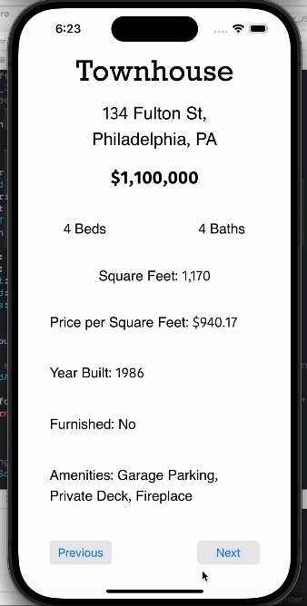

# Property-Listings-App
This iOS application displays property listings fetched from a JSON file. Users can navigate through the listings, viewing details such as property type, price, number of bedrooms and bathrooms, square footage, amenities, and more.

## Installation
1. Clone this repository to your local machine.
2. Open the project in Xcode.
3. Build and run the app on a simulator or physical device.

## Features
- Display property listings fetched from a JSON file.
- Navigate through listings using "Previous" and "Next" buttons.
- View details of each listing, including:
  - Property type
  - Price
  - Number of bedrooms and bathrooms
  - Square footage
  - Year built
  - Furnished status
  - Amenities

## Usage
1. Upon launching the app, the first property listing is displayed.
2. Use the "Next" button to view the next listing.
3. Use the "Previous" button to view the previous listing.
4. Details of each listing are updated accordingly on the UI.

## Demo


## JSON Data Structure
```json
[
  {
    "street_address": "String",
    "city": "String",
    "state": "String",
    "property_type": "String",
    "price": 0,
    "num_beds": 0,
    "num_baths": 0,
    "square_ft": 0,
    "year_built": 0,
    "furnished": true,
    "amenities": ["String"]
  }
]
```

## Technologies Used
- **UIKit**: The primary framework for building the user interface of the iOS application.
- **Foundation Framework**: Used for data storage, persistence, and JSON data parsing.
- **Swift Programming Language**: The main language for developing the iOS application.
- **Xcode**: The integrated development environment (IDE) for writing, testing, and debugging the app.

  
## Contributions
### You can contribute by:
-  Reporting bugs
-  Suggesting new features
-  Submitting pull requests to improve the codebase
